# LAB2


## Additional

### 1. 주어진 영상에 빨강, 파랑, 초록 색의 점을 각각 설정한 개수만큼 무작위로 생성하는 프로그램

```cpp
void SpreadRGB(Mat& img, int num_R, int num_G, int num_B) {
	//빨간 점 무작위 생성
	for (int n = 0; n < num_R; n++) {
		int x = rand() % img.cols;
		int y = rand() % img.rows;

		if (img.channels() == 1)  //이미지가 단일 채녈인 경우
			img.at<uchar>(y, x) = 255;
		else {
			img.at<Vec3b>(y, x)[0] = 0;
			img.at<Vec3b>(y, x)[1] = 0;
			img.at<Vec3b>(y, x)[2] = 255;
		}
	}

	//초록 점 무작위 생성
	for (int n = 0; n < num_G; n++) {
		int x = rand() % img.cols;
		int y = rand() % img.rows;

		if (img.channels() == 1)  //이미지가 단일 채녈인 경우
			img.at<uchar>(y, x) = 255;
		else {
			img.at<Vec3b>(y, x)[0] = 0;
			img.at<Vec3b>(y, x)[1] = 255;
			img.at<Vec3b>(y, x)[2] = 0;
		}
	}

	//파랑 점 생성
	for (int n = 0; n < num_B; n++) {
		int x = rand() % img.cols;
		int y = rand() % img.rows;

		if (img.channels() == 1)  //이미지가 단일 채녈인 경우
			img.at<uchar>(y, x) = 255;
		else {
			img.at<Vec3b>(y, x)[0] = 255;
			img.at<Vec3b>(y, x)[1] = 0;
			img.at<Vec3b>(y, x)[2] = 0;
		}
	}
}
```

위와 같은 코드를 이용하여 주어진 영상에 무작위로 RGB 픽셀을 입력하는 프로그램을 작성했다. 위의 경우는 빨간 픽셀을 입력하는 코드이고 초록 픽셀과 파란 픽셀도 동일한 과정을 거쳐 입력했다.

```cpp
SpreadRGB(src_img, 180, 150, 100);
```
함수를 호출할 때 각각 R G B 값을 몇 개씩 생성할 지 입력했다. 입력한 숫자에 따라 for문이 실행되는 횟수가 정해지고 해당 수만큼 정해진 색의 픽셀이 입력된다.

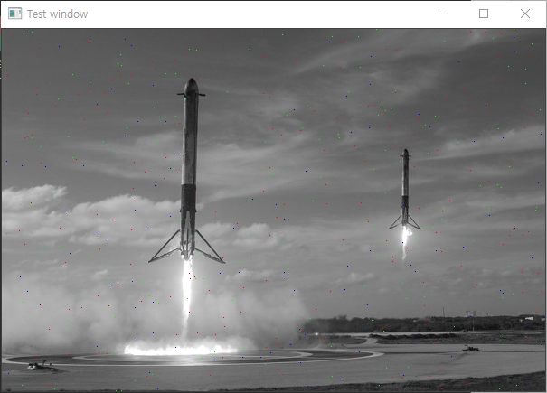

출력된 이미지이다. 흑백 이미지를 컬러로 읽어와 총 3개의 채널이 존재하기 때문에 RGB 각각의 픽셀을 생성할 수 있었으며, 이렇게 삽입된 이미지로 다음 단계를 진행했다.

### 2. 앞서 생성한 영상에서 빨강, 파랑, 초록 색의 점을 각각 카운트하는 프로그램

```cpp
void countRGB(const Mat& img, int& count_R, int& count_G, int& count_B) {
	count_R = 0; count_G = 0; count_B = 0;
	for (int y = 0; y < img.rows; y++) {
		for (int x = 0; x < img.cols; x++) {
			if (img.at<Vec3b>(y, x)[0] == 0
				&& img.at<Vec3b>(y, x)[1] == 0
				&& img.at<Vec3b>(y, x)[2] == 255)
				count_R++;
			else if (img.at<Vec3b>(y, x)[0] == 0
				&& img.at<Vec3b>(y, x)[1] == 255
				&& img.at<Vec3b>(y, x)[2] == 0)
				count_G++;
			else if (img.at<Vec3b>(y, x)[0] == 255
				&& img.at<Vec3b>(y, x)[1] == 0
				&& img.at<Vec3b>(y, x)[2] == 0)
				count_B++;
		}
	}
}
```

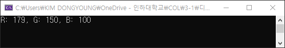

프로그램 실행 결과 위의 결과를 출력한다. RGB각각 180개, 150개, 100개의 픽셀을 입력했으며 실제로 해당하는 픽셀이 존재하는 값은 빨간 픽셀을 제외하고 동일하다. 빨간 픽셀의 경우는 180개를 입력했지만 179개만 존재했는데 이것은 rand함수를 사용할 때 동일한 위치에 빨간 픽셀이 두 번 입력되었거나 초록색이나 파란색 픽셀이 빨간 픽셀을 덮어 씌웠을 것으로 추측되며 프로그램은 정상적으로 실행되었을 것으로 판단된다.

### 3. 주어진 영상을 이용해(img2.jpg) 제시된 것과 같은 두 영상을 생성하는 프로그램

위의 코드를 작성하여 위로 갈수록 어두워지는 프로그램과 아래로 갈수록 어두워지는 프로그램을 작성했다. 이중 for문을 통해 모든 픽셀에 접근하여 직접 값을 수정했다. 픽셀의 어둡기를 조정하는 방법은 픽셀 value에 값을 빼는 방법을 사용했다. 가장 어두운 부분은 픽셀 값을 255 제거하고, 가장 밝은 픽셀은 값을 0 제거하고 그 사이는 차례로 값을 대입했다. 이 연산을 수행하기 위해서 

```cpp
int addValue = 255 - (255 * y / img_1.rows); 
```

식을 사용했다. 

단순히 픽셀에서 값을 제거하면 다음과 같이 overflow가 발생한 것으로 추정되는 결과가 나왔다.

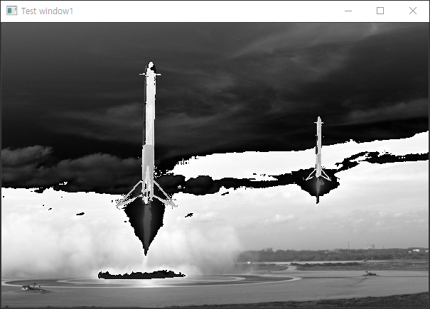


이것을 방지하기 위해 max 함수를 사용하여 밝기 값이 0이만으로 떨어지지 않도록 하여 아래와 같은 결과를 얻었다.

|-|위로 갈수로 어두움|아래로 갈수록 어두움|
|-|-|-|
|결과|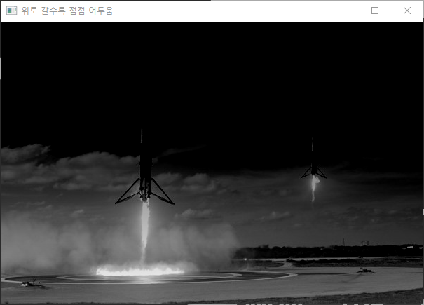|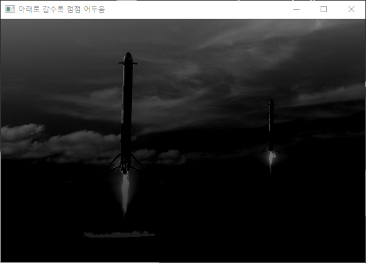|
|히스토그램|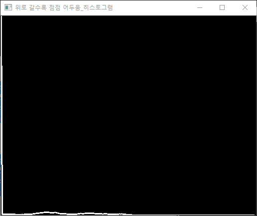|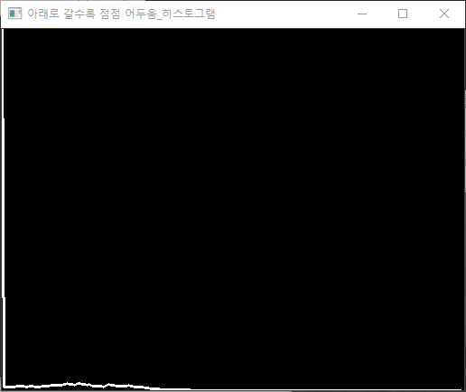|

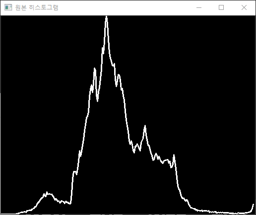

원본 히스토그램


각각의 결과 나타난 히스토그램과 원본 히스토그램은 다음과 같다. 영상이 전체적으로 어두워졌기 때문에 히스토그램의 값이 전체적으로 급격히 왼쪽으로 이동했으며 상당이 유사한 결과가 나온 것을 알 수 있었다. 그러나 각각의 방식으로 얻어낸 히스토그램은 약간의 차이가 존재했는데 이는 위와 아래 부분의 전체적인 밝기에 차이가 존재했기 때문임을 알 수 있다. 위로 갈수록 어두워지는 사진의 경우는 밝은 부분이 다른 사진보다 많이 남아있는데 이로 인해서 히스토그램 그래프의 밝은 픽셀이 존재하는 정도가 더 많다.


### 4. 주어진 영상(img3.jpg, img4.jpg, img5.jpg)을 이용해 제시된 영상을 완성

```cpp
Mat imgA = imread("image/img3.jpg", 1);
Mat imgB = imread("image/img4.jpg", 1);
Mat logo = imread("image/img5.jpg", 1); // 로고 영상 읽기
Mat logo_gray = imread("image/img5.jpg", 0); // 마스크로 사용위해 흑백영상으로 읽기
resize(imgB, imgB, Size(imgA.cols, imgA.rows)); //이미지 사이즈 변환
Mat dst;

subtract(imgA, imgB, dst); //비네팅 완료된 영상

Mat ROIdst(dst, Rect(dst.cols/2 - logo.cols/2, dst.rows/2 - logo.rows/2 + 60, logo.cols, logo.rows));
Mat mask(180 - logo_gray);
logo.copyTo(ROIdst, mask);
```

위 코드를 사용해 제시된 영상을 구현했다. subtract 함수를 이용해 영상의 가장자리가 어두워지는 효과가 나타나도록 했고 이렇게 처리한 결과를 dst에 저장했다. 이때 영상의 사이즈가 다르면 연산이 진행되지 않아 resize를 진행했다. 
로고의 흰색 배경이 존재하여 배경을 제거하기 위해 mask를 적용했다. 마스크 적용을 위해 영상을 흑백으로 읽어오고 mask에 적용하는 값을 적절히 조정하여 흰색을 제외한 모든 값이 영상에 붙여 넣어지도록 했다. 영상에 로고를 넣을 때는 copyTo 함수를 사용했다. 최종 출력 결과는 다음과 같다.

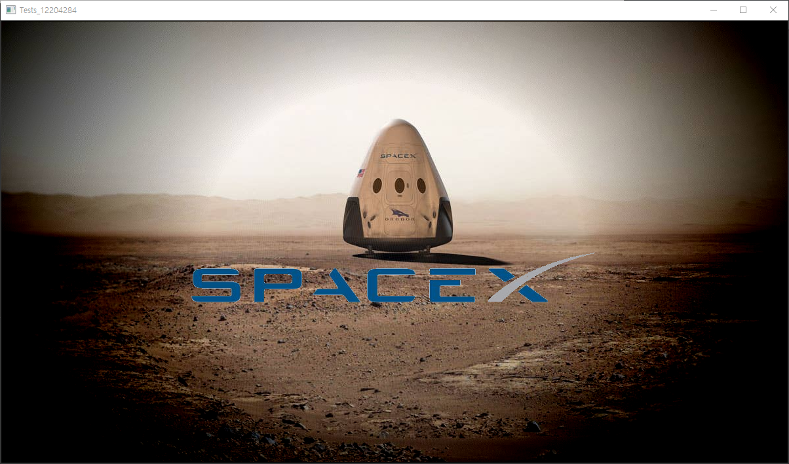


로고를 원하는 위치에 붙여 넣기 위해서는 로고를 붙여 넣을 위치를 계산하는 것이 중요했다. 로고의 관심영역(Region of interest)인 ROI는 로고의 왼쪽 위 부분부터 시작해 로고의 크기만큼 할당된다. 

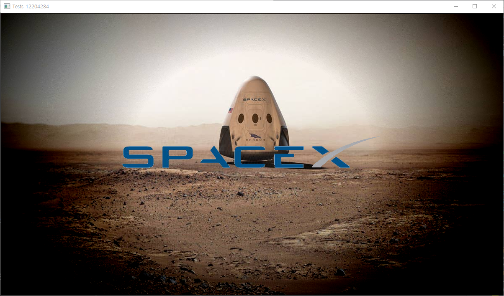

로고를 배경 정 가운데 위치에 삽입하면 위와 같은 결과가 나오고 +60 픽셀만큼 아래로 이동하여 원하는 결과를 얻을 수 있었다.

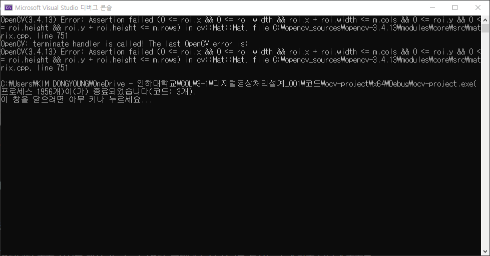

로고의 ROI가 원하는 위치를 벗어날 경우에는 위와 같은 에러를 출력하며 프로그램이 정상적으로 실행되지 않았다. 따라 이 값을 적절히 조절하여 roi를 포함하는 mask를 적용하고 ROIdst 영상에 붙여넣었다.

[Additional Code Source](/src/3주차과제.cpp)

---

